# LDA Outcomes Tool - Architecture Documentation

## Table of Contents
1. [System Architecture](#1-system-architecture)
2. [Database Schema](#2-database-schema)
3. [Component Architecture](#3-component-architecture)
4. [Authentication Flow](#4-authentication-flow)
5. [Deployment Architecture](#5-deployment-architecture)
6. [API Architecture](#6-api-architecture)
7. [Data Flow Diagrams](#7-data-flow-diagrams)

---

## 1. System Architecture

### 1.1 High-Level System Architecture

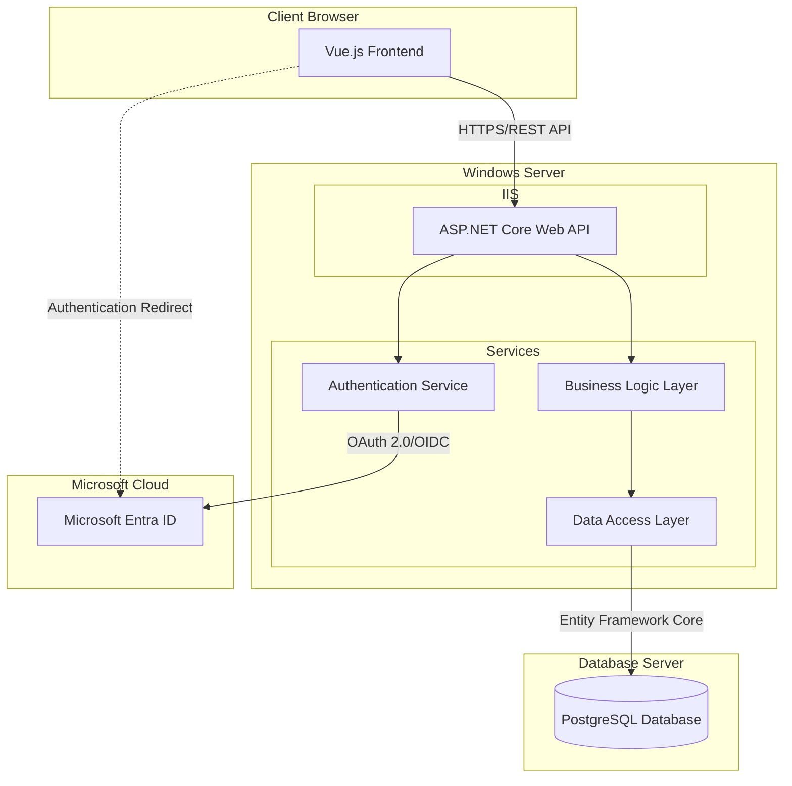
```mermaid
graph TB
    subgraph "Client Browser"
        UI[Vue.js Frontend]
    end

    subgraph "Windows Server"
        subgraph "IIS"
            WEB[ASP.NET Core Web API]
        end

        subgraph "Services"
            AUTH[Authentication Service]
            BIZ[Business Logic Layer]
            DATA[Data Access Layer]
        end
    end

    subgraph "Database Server"
        DB[(PostgreSQL Database)]
    end

    subgraph "Microsoft Cloud"
        ENTRA[Microsoft Entra ID]
    end

    UI -->|HTTPS/REST API| WEB
    WEB --> AUTH
    WEB --> BIZ
    BIZ --> DATA
    DATA -->|Entity Framework Core| DB
    AUTH -->|OAuth 2.0/OIDC| ENTRA
    UI -.->|Authentication Redirect| ENTRA
```

### 1.2 Technology Stack Overview

| Layer | Technology | Purpose |
|-------|-----------|---------|
| **Frontend** | Vue.js 3 + Vite | Modern reactive UI framework |
| **CSS** | Tailwind CSS | Utility-first CSS framework |
| **Backend** | ASP.NET Core 8.0 | RESTful API server |
| **ORM** | Entity Framework Core | Database abstraction layer |
| **Database** | PostgreSQL 14+ | Primary data store |
| **Authentication** | Microsoft Entra ID | Identity & access management |
| **Web Server** | IIS 10+ | Windows-based web server |
| **Runtime** | .NET 8.0 Runtime | Application runtime environment |

---

## 2. Database Schema

### 2.1 Entity Relationship Diagram

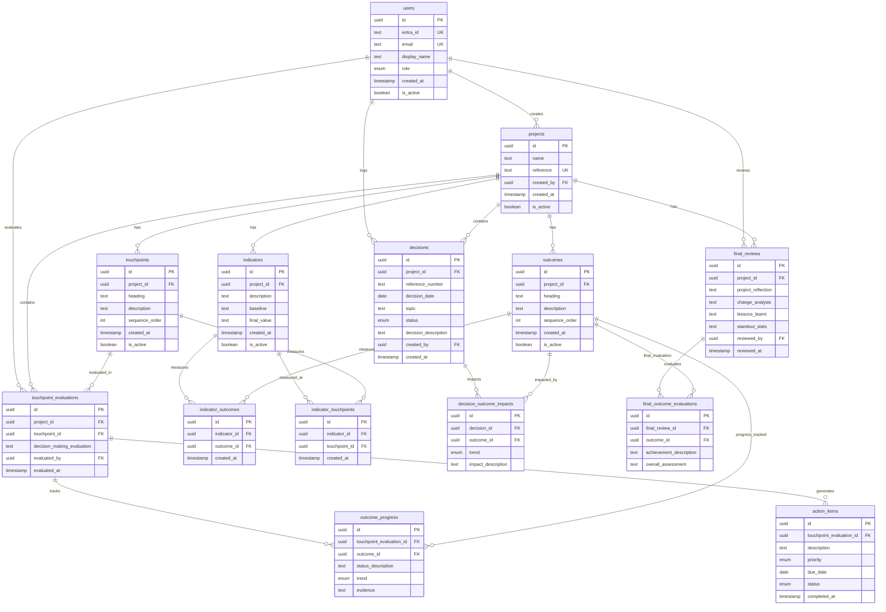
```mermaid
erDiagram
    users ||--o{ projects : "creates"
    users ||--o{ decisions : "logs"
    users ||--o{ touchpoint_evaluations : "evaluates"
    users ||--o{ final_reviews : "reviews"

    projects ||--o{ outcomes : "has"
    projects ||--o{ touchpoints : "has"
    projects ||--o{ indicators : "has"
    projects ||--o{ decisions : "contains"
    projects ||--o{ touchpoint_evaluations : "contains"
    projects ||--o{ final_reviews : "has"

    indicators ||--o{ indicator_outcomes : "measures"
    outcomes ||--o{ indicator_outcomes : "measured_by"

    indicators ||--o{ indicator_touchpoints : "measured_at"
    touchpoints ||--o{ indicator_touchpoints : "measures"

    decisions ||--o{ decision_outcome_impacts : "impacts"
    outcomes ||--o{ decision_outcome_impacts : "impacted_by"

    touchpoints ||--o{ touchpoint_evaluations : "evaluated_in"
    touchpoint_evaluations ||--o{ outcome_progress : "tracks"
    touchpoint_evaluations ||--o{ action_items : "generates"
    outcomes ||--o{ outcome_progress : "progress_tracked"

    final_reviews ||--o{ final_outcome_evaluations : "evaluates"
    outcomes ||--o{ final_outcome_evaluations : "final_evaluation"

    users {
        uuid id PK
        text entra_id UK
        text email UK
        text display_name
        enum role
        timestamp created_at
        boolean is_active
    }

    projects {
        uuid id PK
        text name
        text reference UK
        uuid created_by FK
        timestamp created_at
        boolean is_active
    }

    outcomes {
        uuid id PK
        uuid project_id FK
        text heading
        text description
        int sequence_order
        timestamp created_at
        boolean is_active
    }

    touchpoints {
        uuid id PK
        uuid project_id FK
        text heading
        text description
        int sequence_order
        timestamp created_at
        boolean is_active
    }

    indicators {
        uuid id PK
        uuid project_id FK
        text description
        text baseline
        text final_value
        timestamp created_at
        boolean is_active
    }

    indicator_outcomes {
        uuid id PK
        uuid indicator_id FK
        uuid outcome_id FK
        timestamp created_at
    }

    indicator_touchpoints {
        uuid id PK
        uuid indicator_id FK
        uuid touchpoint_id FK
        timestamp created_at
    }

    decisions {
        uuid id PK
        uuid project_id FK
        text reference_number
        date decision_date
        text topic
        enum status
        text decision_description
        uuid created_by FK
        timestamp created_at
    }

    decision_outcome_impacts {
        uuid id PK
        uuid decision_id FK
        uuid outcome_id FK
        enum trend
        text impact_description
    }

    touchpoint_evaluations {
        uuid id PK
        uuid project_id FK
        uuid touchpoint_id FK
        text decision_making_evaluation
        uuid evaluated_by FK
        timestamp evaluated_at
    }

    outcome_progress {
        uuid id PK
        uuid touchpoint_evaluation_id FK
        uuid outcome_id FK
        text status_description
        enum trend
        text evidence
    }

    action_items {
        uuid id PK
        uuid touchpoint_evaluation_id FK
        text description
        enum priority
        date due_date
        enum status
        timestamp completed_at
    }

    final_reviews {
        uuid id PK
        uuid project_id FK
        text project_reflection
        text change_analysis
        text lessons_learnt
        text standout_stats
        uuid reviewed_by FK
        timestamp reviewed_at
    }

    final_outcome_evaluations {
        uuid id PK
        uuid final_review_id FK
        uuid outcome_id FK
        text achievement_description
        text overall_assessment
    }
```

### 2.2 Database Schema Organization

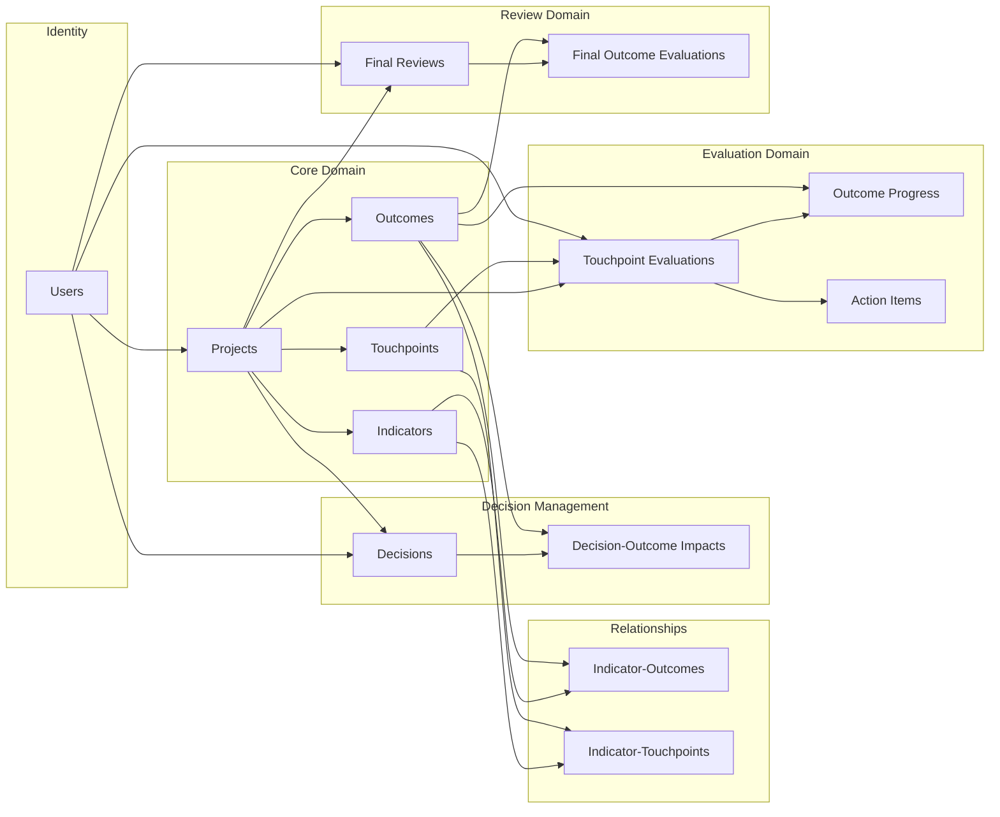
```mermaid
graph LR
    subgraph "Core Domain"
        PROJ[Projects]
        OUT[Outcomes]
        TP[Touchpoints]
        IND[Indicators]
    end

    subgraph "Relationships"
        IO[Indicator-Outcomes]
        IT[Indicator-Touchpoints]
    end

    subgraph "Decision Management"
        DEC[Decisions]
        DOI[Decision-Outcome Impacts]
    end

    subgraph "Evaluation Domain"
        TPE[Touchpoint Evaluations]
        OP[Outcome Progress]
        AI[Action Items]
    end

    subgraph "Review Domain"
        FR[Final Reviews]
        FOE[Final Outcome Evaluations]
    end

    subgraph "Identity"
        USR[Users]
    end

    PROJ --> OUT
    PROJ --> TP
    PROJ --> IND
    IND --> IO
    IND --> IT
    OUT --> IO
    TP --> IT
    PROJ --> DEC
    DEC --> DOI
    OUT --> DOI
    PROJ --> TPE
    TP --> TPE
    TPE --> OP
    TPE --> AI
    OUT --> OP
    PROJ --> FR
    FR --> FOE
    OUT --> FOE
    USR --> PROJ
    USR --> DEC
    USR --> TPE
    USR --> FR
```

---

## 3. Component Architecture

### 3.1 Backend Component Structure

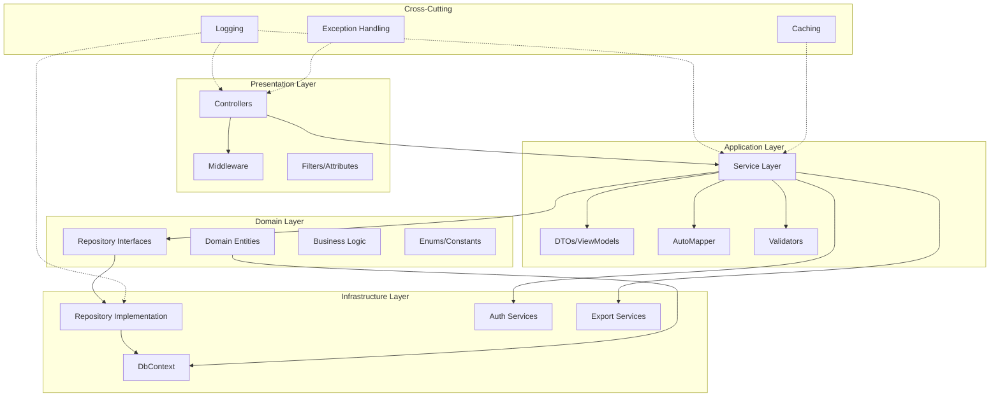
```mermaid
graph TB
    subgraph "Presentation Layer"
        CTRL[Controllers]
        MW[Middleware]
        FILTERS[Filters/Attributes]
    end

    subgraph "Application Layer"
        SERVICES[Service Layer]
        DTOS[DTOs/ViewModels]
        MAPPERS[AutoMapper]
        VALIDATORS[Validators]
    end

    subgraph "Domain Layer"
        ENTITIES[Domain Entities]
        INTERFACES[Repository Interfaces]
        LOGIC[Business Logic]
        ENUMS[Enums/Constants]
    end

    subgraph "Infrastructure Layer"
        REPOS[Repository Implementation]
        DBCONTEXT[DbContext]
        AUTH[Auth Services]
        EXPORT[Export Services]
    end

    subgraph "Cross-Cutting"
        LOGGING[Logging]
        CACHE[Caching]
        EXCEPTIONS[Exception Handling]
    end

    CTRL --> SERVICES
    CTRL --> MW
    SERVICES --> DTOS
    SERVICES --> MAPPERS
    SERVICES --> VALIDATORS
    SERVICES --> INTERFACES
    INTERFACES --> REPOS
    REPOS --> DBCONTEXT
    SERVICES --> AUTH
    SERVICES --> EXPORT
    ENTITIES --> DBCONTEXT

    LOGGING -.-> CTRL
    LOGGING -.-> SERVICES
    LOGGING -.-> REPOS
    CACHE -.-> SERVICES
    EXCEPTIONS -.-> CTRL
```

### 3.2 Backend Folder Structure

```
LdaOutcomesTool.API/
├── Controllers/           # API Controllers
│   ├── AuthController.cs
│   ├── ProjectsController.cs
│   ├── OutcomesController.cs
│   ├── TouchpointsController.cs
│   ├── IndicatorsController.cs
│   ├── DecisionsController.cs
│   ├── EvaluationsController.cs
│   └── ReviewsController.cs
├── Services/              # Business logic services
│   ├── IProjectService.cs
│   ├── ProjectService.cs
│   ├── IAuthService.cs
│   ├── AuthService.cs
│   ├── IExportService.cs
│   └── ExportService.cs
├── Models/                # Domain entities
│   ├── Entities/
│   │   ├── User.cs
│   │   ├── Project.cs
│   │   ├── Outcome.cs
│   │   ├── Touchpoint.cs
│   │   ├── Indicator.cs
│   │   ├── Decision.cs
│   │   └── ...
│   ├── DTOs/
│   │   ├── ProjectDto.cs
│   │   ├── CreateProjectDto.cs
│   │   └── ...
│   └── Enums/
│       ├── UserRole.cs
│       ├── DecisionStatus.cs
│       └── TrendIndicator.cs
├── Data/                  # Database context & repositories
│   ├── LdaDbContext.cs
│   ├── Repositories/
│   │   ├── IProjectRepository.cs
│   │   ├── ProjectRepository.cs
│   │   └── ...
│   └── Migrations/
├── Middleware/            # Custom middleware
│   ├── ErrorHandlingMiddleware.cs
│   └── AuditLoggingMiddleware.cs
├── Mapping/               # AutoMapper profiles
│   └── MappingProfile.cs
├── Validators/            # FluentValidation
│   ├── CreateProjectValidator.cs
│   └── ...
├── Infrastructure/        # External services
│   ├── Auth/
│   │   └── EntraIdAuthService.cs
│   └── Export/
│       ├── CsvExportService.cs
│       └── PdfExportService.cs
├── Extensions/            # Extension methods
│   └── ServiceCollectionExtensions.cs
├── appsettings.json
├── appsettings.Development.json
└── Program.cs
```

### 3.3 Frontend Component Structure

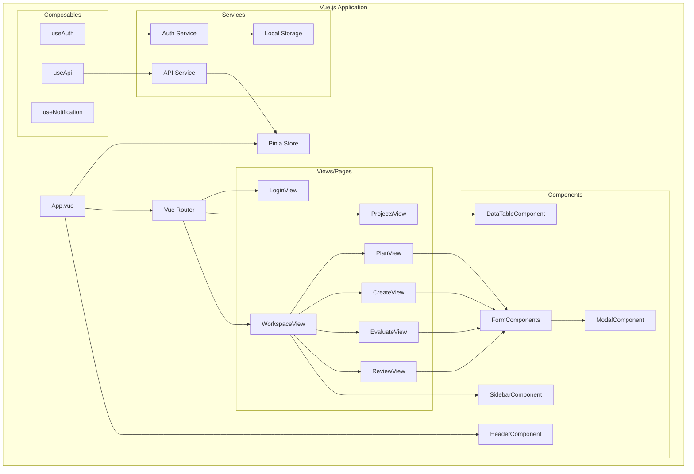
```mermaid
graph TB
    subgraph "Vue.js Application"
        APP[App.vue]
        ROUTER[Vue Router]
        STORE[Pinia Store]

        subgraph "Views/Pages"
            LOGIN[LoginView]
            PROJECTS[ProjectsView]
            WORKSPACE[WorkspaceView]
            PLAN[PlanView]
            CREATE[CreateView]
            EVALUATE[EvaluateView]
            REVIEW[ReviewView]
        end

        subgraph "Components"
            HEADER[HeaderComponent]
            SIDEBAR[SidebarComponent]
            TABLE[DataTableComponent]
            FORM[FormComponents]
            MODAL[ModalComponent]
        end

        subgraph "Composables"
            API[useApi]
            AUTH_COMP[useAuth]
            NOTIF[useNotification]
        end

        subgraph "Services"
            API_SVC[API Service]
            AUTH_SVC[Auth Service]
            STORAGE[Local Storage]
        end
    end

    APP --> ROUTER
    APP --> STORE
    ROUTER --> LOGIN
    ROUTER --> PROJECTS
    ROUTER --> WORKSPACE
    WORKSPACE --> PLAN
    WORKSPACE --> CREATE
    WORKSPACE --> EVALUATE
    WORKSPACE --> REVIEW

    PROJECTS --> TABLE
    PLAN --> FORM
    CREATE --> FORM
    EVALUATE --> FORM
    REVIEW --> FORM

    WORKSPACE --> SIDEBAR
    APP --> HEADER

    FORM --> MODAL

    API --> API_SVC
    AUTH_COMP --> AUTH_SVC
    API_SVC --> STORE
    AUTH_SVC --> STORAGE
```

### 3.4 Frontend Folder Structure

```
lda-outcomes-tool-ui/
├── public/
├── src/
│   ├── assets/           # Static assets
│   │   ├── images/
│   │   └── styles/
│   ├── components/       # Reusable components
│   │   ├── common/
│   │   │   ├── Button.vue
│   │   │   ├── Modal.vue
│   │   │   ├── DataTable.vue
│   │   │   └── ...
│   │   ├── forms/
│   │   │   ├── TextInput.vue
│   │   │   ├── TextArea.vue
│   │   │   ├── Select.vue
│   │   │   └── ...
│   │   └── layout/
│   │       ├── Header.vue
│   │       ├── Sidebar.vue
│   │       └── Footer.vue
│   ├── views/            # Page components
│   │   ├── LoginView.vue
│   │   ├── ProjectsView.vue
│   │   ├── WorkspaceView.vue
│   │   └── ...
│   ├── composables/      # Composition API composables
│   │   ├── useApi.js
│   │   ├── useAuth.js
│   │   ├── useNotification.js
│   │   └── ...
│   ├── stores/           # Pinia stores
│   │   ├── auth.js
│   │   ├── projects.js
│   │   ├── outcomes.js
│   │   └── ...
│   ├── services/         # API services
│   │   ├── api.js
│   │   ├── auth.js
│   │   ├── projects.js
│   │   └── ...
│   ├── router/           # Vue Router config
│   │   └── index.js
│   ├── utils/            # Utility functions
│   │   ├── formatters.js
│   │   ├── validators.js
│   │   └── constants.js
│   ├── App.vue
│   └── main.js
├── index.html
├── package.json
├── vite.config.js
├── tailwind.config.js
└── postcss.config.js
```

---

## 4. Authentication Flow

### 4.1 Microsoft Entra ID Authentication Flow

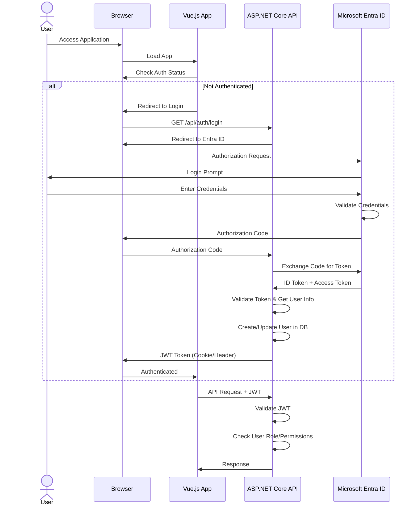
```mermaid
sequenceDiagram
    actor User
    participant Browser
    participant VueApp as Vue.js App
    participant API as ASP.NET Core API
    participant EntraID as Microsoft Entra ID

    User->>Browser: Access Application
    Browser->>VueApp: Load App
    VueApp->>Browser: Check Auth Status

    alt Not Authenticated
        VueApp->>Browser: Redirect to Login
        Browser->>API: GET /api/auth/login
        API->>Browser: Redirect to Entra ID
        Browser->>EntraID: Authorization Request
        EntraID->>User: Login Prompt
        User->>EntraID: Enter Credentials
        EntraID->>EntraID: Validate Credentials
        EntraID->>Browser: Authorization Code
        Browser->>API: Authorization Code
        API->>EntraID: Exchange Code for Token
        EntraID->>API: ID Token + Access Token
        API->>API: Validate Token & Get User Info
        API->>API: Create/Update User in DB
        API->>Browser: JWT Token (Cookie/Header)
        Browser->>VueApp: Authenticated
    end

    VueApp->>API: API Request + JWT
    API->>API: Validate JWT
    API->>API: Check User Role/Permissions
    API->>VueApp: Response
```

### 4.2 Token Flow

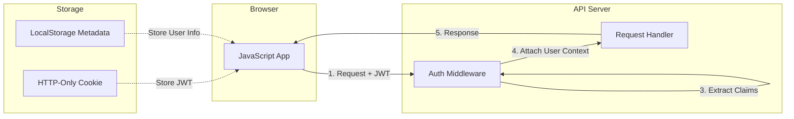
```mermaid
graph LR
    subgraph "Browser"
        JS[JavaScript App]
    end

    subgraph "API Server"
        AUTH[Auth Middleware]
        HANDLER[Request Handler]
    end

    subgraph "Storage"
        COOKIE[HTTP-Only Cookie]
        LS[LocalStorage Metadata]
    end

    JS -->|1. Request + JWT| AUTH
    AUTH -->|2. Validate JWT| AUTH
    AUTH -->|3. Extract Claims| AUTH
    AUTH -->|4. Attach User Context| HANDLER
    HANDLER -->|5. Response| JS

    COOKIE -.->|Store JWT| JS
    LS -.->|Store User Info| JS
```

### 4.3 Authorization & Role-Based Access

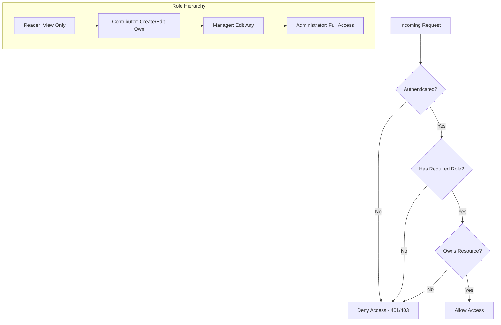
```mermaid
graph TB
    REQUEST[Incoming Request]
    AUTH_CHECK{Authenticated?}
    ROLE_CHECK{Has Required Role?}
    RESOURCE_CHECK{Owns Resource?}
    ALLOW[Allow Access]
    DENY[Deny Access - 401/403]

    REQUEST --> AUTH_CHECK
    AUTH_CHECK -->|No| DENY
    AUTH_CHECK -->|Yes| ROLE_CHECK
    ROLE_CHECK -->|No| DENY
    ROLE_CHECK -->|Yes| RESOURCE_CHECK
    RESOURCE_CHECK -->|No| DENY
    RESOURCE_CHECK -->|Yes| ALLOW

    subgraph "Role Hierarchy"
        READER[Reader: View Only]
        CONTRIBUTOR[Contributor: Create/Edit Own]
        MANAGER[Manager: Edit Any]
        ADMIN[Administrator: Full Access]

        READER --> CONTRIBUTOR
        CONTRIBUTOR --> MANAGER
        MANAGER --> ADMIN
    end
```

---

## 5. Deployment Architecture

### 5.1 Windows Server Deployment

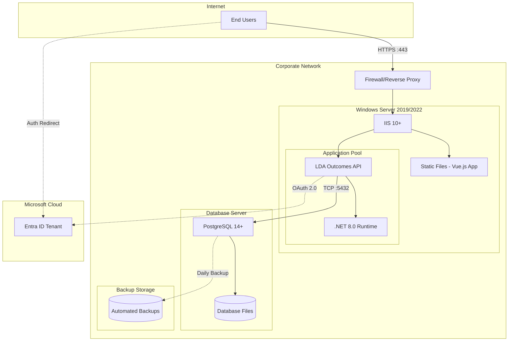
```mermaid
graph TB
    subgraph "Internet"
        USERS[End Users]
    end

    subgraph "Corporate Network"
        FW[Firewall/Reverse Proxy]

        subgraph "Windows Server 2019/2022"
            IIS[IIS 10+]

            subgraph "Application Pool"
                DOTNET[.NET 8.0 Runtime]
                APP[LDA Outcomes API]
            end

            FILES[Static Files - Vue.js App]
        end

        subgraph "Database Server"
            PG[PostgreSQL 14+]
            PGDATA[(Database Files)]
        end

        subgraph "Backup Storage"
            BACKUPS[(Automated Backups)]
        end
    end

    subgraph "Microsoft Cloud"
        ENTRA[Entra ID Tenant]
    end

    USERS -->|HTTPS :443| FW
    FW --> IIS
    IIS --> FILES
    IIS --> APP
    APP --> DOTNET
    APP -->|TCP :5432| PG
    PG --> PGDATA
    PG -.->|Daily Backup| BACKUPS
    APP -.->|OAuth 2.0| ENTRA
    USERS -.->|Auth Redirect| ENTRA
```

### 5.2 IIS Configuration

```mermaid
graph LR
    subgraph "IIS Server"
        subgraph "Default Web Site"
            ROOT[/ Root]
            API[/api Application]
        end

        subgraph "Application Pools"
            POOL1[DefaultAppPool]
            POOL2[LdaOutcomesToolPool]
        end

        subgraph "Files"
            STATIC[wwwroot/ - Vue.js Build]
            APIFILES[API Deployment Files]
        end
    end

    ROOT -->|Serves| STATIC
    ROOT -->|Reverse Proxy| API
    API --> POOL2
    POOL2 --> APIFILES

    POOL2 -.->|Identity| APPSVC[Application Service Account]
```

### 5.3 Network Topology

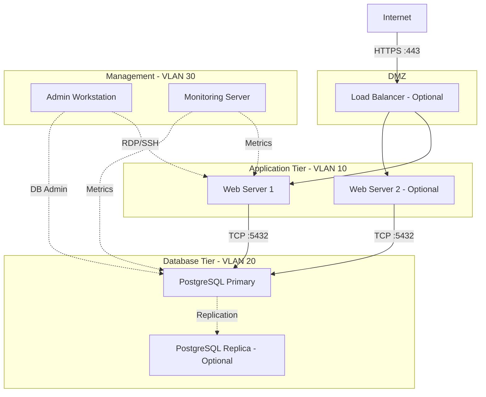
```mermaid
graph TB
    subgraph "DMZ"
        LB[Load Balancer - Optional]
    end

    subgraph "Application Tier - VLAN 10"
        WEB1[Web Server 1]
        WEB2[Web Server 2 - Optional]
    end

    subgraph "Database Tier - VLAN 20"
        DB1[PostgreSQL Primary]
        DB2[PostgreSQL Replica - Optional]
    end

    subgraph "Management - VLAN 30"
        ADMIN[Admin Workstation]
        MONITOR[Monitoring Server]
    end

    INTERNET[Internet] -->|HTTPS :443| LB
    LB --> WEB1
    LB --> WEB2
    WEB1 -->|TCP :5432| DB1
    WEB2 -->|TCP :5432| DB1
    DB1 -.->|Replication| DB2
    ADMIN -.->|RDP/SSH| WEB1
    ADMIN -.->|DB Admin| DB1
    MONITOR -.->|Metrics| WEB1
    MONITOR -.->|Metrics| DB1
```

---

## 6. API Architecture

### 6.1 RESTful API Design

```mermaid
graph LR
    subgraph "API Endpoints"
        AUTH[/api/v1/auth]
        PROJ[/api/v1/projects]
        OUT[/api/v1/projects/:id/outcomes]
        TP[/api/v1/projects/:id/touchpoints]
        IND[/api/v1/projects/:id/indicators]
        DEC[/api/v1/projects/:id/decisions]
        EVAL[/api/v1/evaluations]
        REV[/api/v1/reviews]
    end

    subgraph "HTTP Methods"
        GET[GET - Read]
        POST[POST - Create]
        PUT[PUT - Update]
        DELETE[DELETE - Remove]
    end

    subgraph "Controllers"
        AUTH_CTRL[AuthController]
        PROJ_CTRL[ProjectsController]
        OUT_CTRL[OutcomesController]
        DEC_CTRL[DecisionsController]
    end

    AUTH --> AUTH_CTRL
    PROJ --> PROJ_CTRL
    OUT --> OUT_CTRL
    DEC --> DEC_CTRL
```

### 6.2 Request/Response Flow

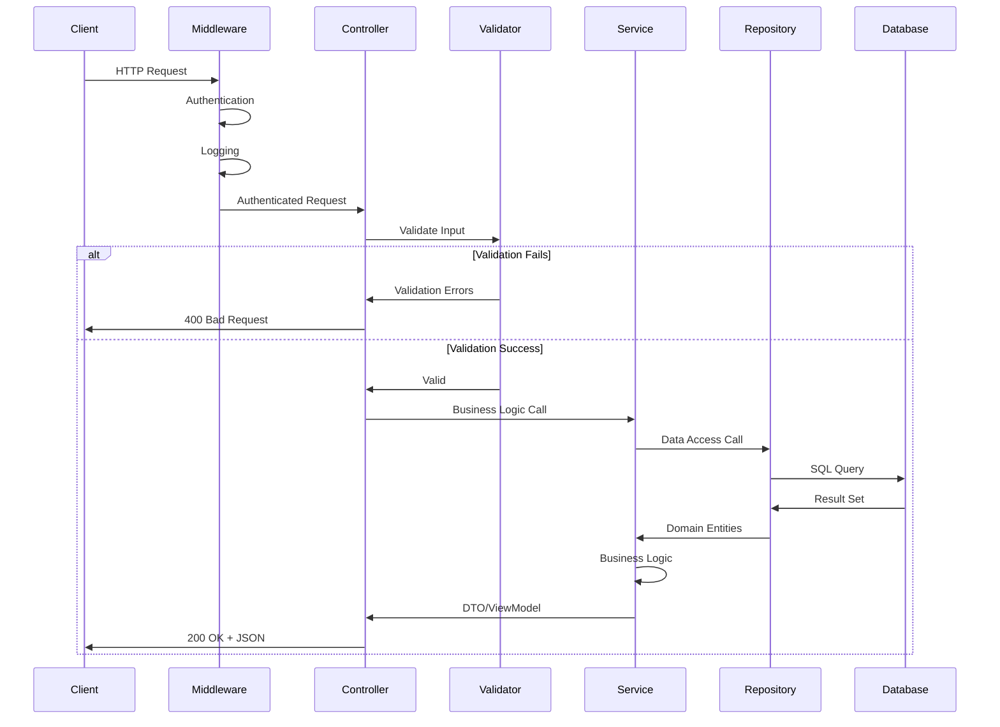
```mermaid
sequenceDiagram
    participant Client
    participant Middleware
    participant Controller
    participant Validator
    participant Service
    participant Repository
    participant Database

    Client->>Middleware: HTTP Request
    Middleware->>Middleware: Authentication
    Middleware->>Middleware: Logging
    Middleware->>Controller: Authenticated Request
    Controller->>Validator: Validate Input

    alt Validation Fails
        Validator->>Controller: Validation Errors
        Controller->>Client: 400 Bad Request
    else Validation Success
        Validator->>Controller: Valid
        Controller->>Service: Business Logic Call
        Service->>Repository: Data Access Call
        Repository->>Database: SQL Query
        Database->>Repository: Result Set
        Repository->>Service: Domain Entities
        Service->>Service: Business Logic
        Service->>Controller: DTO/ViewModel
        Controller->>Client: 200 OK + JSON
    end
```

### 6.3 API Versioning Strategy

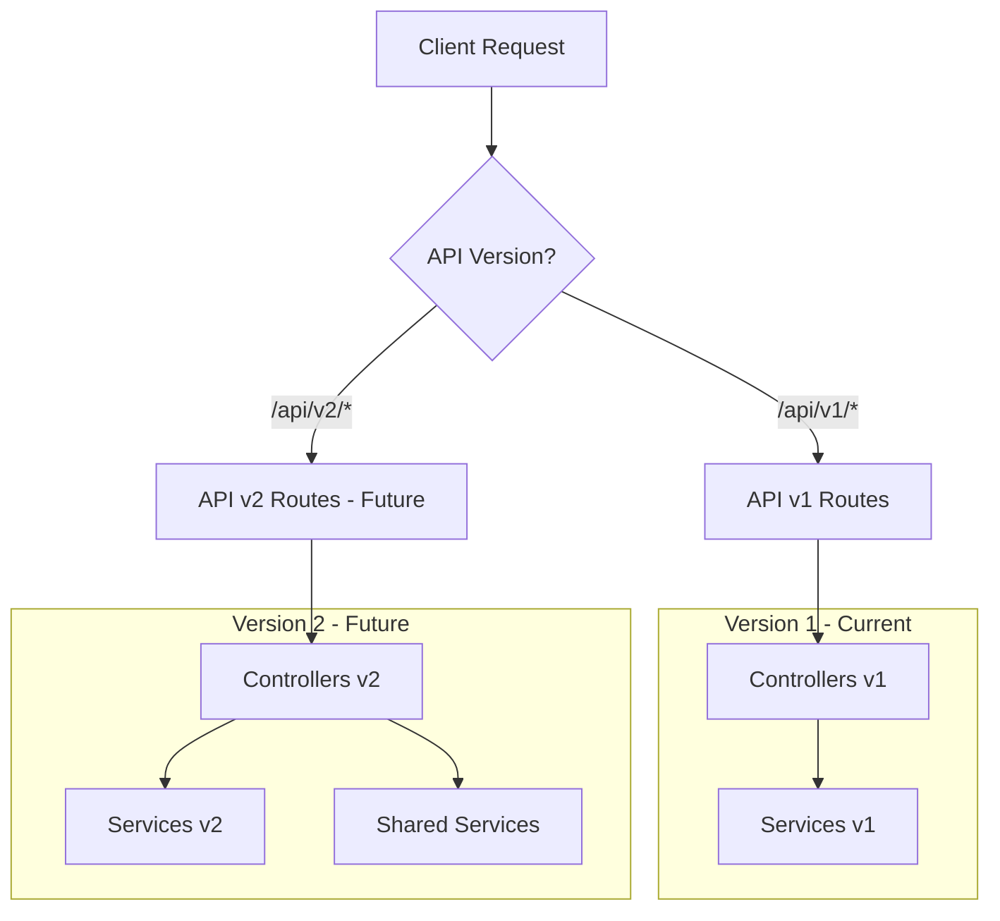
```mermaid
graph TB
    CLIENT[Client Request]
    ROUTE{API Version?}
    V1[API v1 Routes]
    V2[API v2 Routes - Future]

    CLIENT --> ROUTE
    ROUTE -->|/api/v1/*| V1
    ROUTE -->|/api/v2/*| V2

    subgraph "Version 1 - Current"
        V1_CTRL[Controllers v1]
        V1_SVC[Services v1]
    end

    subgraph "Version 2 - Future"
        V2_CTRL[Controllers v2]
        V2_SVC[Services v2]
        SHARED_SVC[Shared Services]
    end

    V1 --> V1_CTRL
    V1_CTRL --> V1_SVC
    V2 --> V2_CTRL
    V2_CTRL --> V2_SVC
    V2_CTRL --> SHARED_SVC
```

---

## 7. Data Flow Diagrams

### 7.1 Project Creation Flow

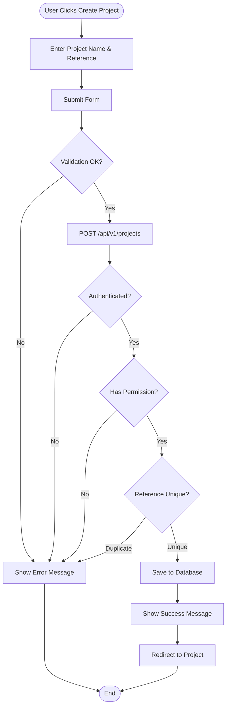
```mermaid
flowchart TD
    START([User Clicks Create Project])
    INPUT[Enter Project Name & Reference]
    SUBMIT[Submit Form]
    VALIDATE{Validation OK?}
    API_CALL[POST /api/v1/projects]
    AUTH_CHECK{Authenticated?}
    PERM_CHECK{Has Permission?}
    DUP_CHECK{Reference Unique?}
    SAVE[Save to Database]
    NOTIFY[Show Success Message]
    REDIRECT[Redirect to Project]
    ERROR[Show Error Message]
    END([End])

    START --> INPUT
    INPUT --> SUBMIT
    SUBMIT --> VALIDATE
    VALIDATE -->|No| ERROR
    VALIDATE -->|Yes| API_CALL
    API_CALL --> AUTH_CHECK
    AUTH_CHECK -->|No| ERROR
    AUTH_CHECK -->|Yes| PERM_CHECK
    PERM_CHECK -->|No| ERROR
    PERM_CHECK -->|Yes| DUP_CHECK
    DUP_CHECK -->|Duplicate| ERROR
    DUP_CHECK -->|Unique| SAVE
    SAVE --> NOTIFY
    NOTIFY --> REDIRECT
    REDIRECT --> END
    ERROR --> END
```

### 7.2 Evaluation Workflow

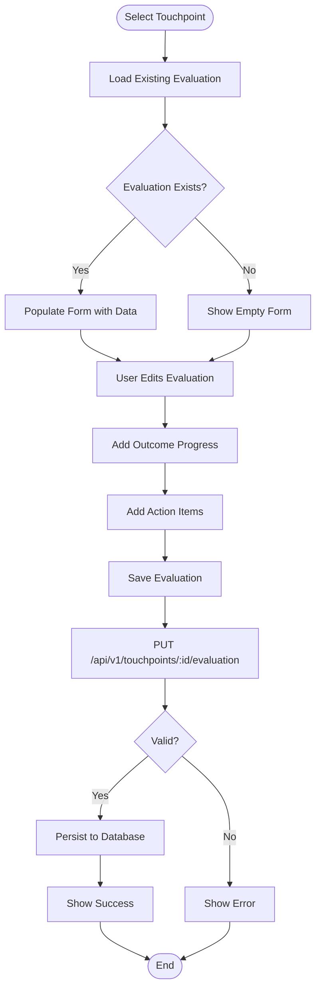
```mermaid
flowchart TD
    START([Select Touchpoint])
    LOAD[Load Existing Evaluation]
    EXISTS{Evaluation Exists?}
    POPULATE[Populate Form with Data]
    EMPTY[Show Empty Form]
    EDIT[User Edits Evaluation]
    ADD_PROGRESS[Add Outcome Progress]
    ADD_ACTIONS[Add Action Items]
    SAVE[Save Evaluation]
    API[PUT /api/v1/touchpoints/:id/evaluation]
    VALIDATE{Valid?}
    PERSIST[Persist to Database]
    SUCCESS[Show Success]
    ERROR[Show Error]
    END([End])

    START --> LOAD
    LOAD --> EXISTS
    EXISTS -->|Yes| POPULATE
    EXISTS -->|No| EMPTY
    POPULATE --> EDIT
    EMPTY --> EDIT
    EDIT --> ADD_PROGRESS
    ADD_PROGRESS --> ADD_ACTIONS
    ADD_ACTIONS --> SAVE
    SAVE --> API
    API --> VALIDATE
    VALIDATE -->|No| ERROR
    VALIDATE -->|Yes| PERSIST
    PERSIST --> SUCCESS
    SUCCESS --> END
    ERROR --> END
```

### 7.3 Data Export Flow

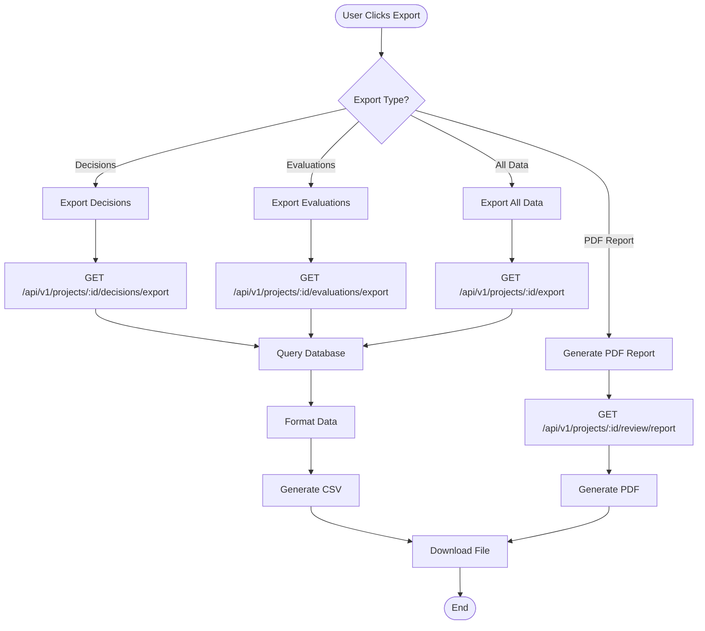
```mermaid
flowchart TD
    START([User Clicks Export])
    SELECT{Export Type?}

    DECISIONS[Export Decisions]
    EVALUATIONS[Export Evaluations]
    FULL[Export All Data]
    PDF[Generate PDF Report]

    API_DEC[GET /api/v1/projects/:id/decisions/export]
    API_EVAL[GET /api/v1/projects/:id/evaluations/export]
    API_FULL[GET /api/v1/projects/:id/export]
    API_PDF[GET /api/v1/projects/:id/review/report]

    QUERY[Query Database]
    FORMAT[Format Data]

    CSV[Generate CSV]
    GEN_PDF[Generate PDF]

    DOWNLOAD[Download File]
    END([End])

    START --> SELECT
    SELECT -->|Decisions| DECISIONS
    SELECT -->|Evaluations| EVALUATIONS
    SELECT -->|All Data| FULL
    SELECT -->|PDF Report| PDF

    DECISIONS --> API_DEC
    EVALUATIONS --> API_EVAL
    FULL --> API_FULL
    PDF --> API_PDF

    API_DEC --> QUERY
    API_EVAL --> QUERY
    API_FULL --> QUERY

    QUERY --> FORMAT
    FORMAT --> CSV

    API_PDF --> GEN_PDF

    CSV --> DOWNLOAD
    GEN_PDF --> DOWNLOAD
    DOWNLOAD --> END
```

### 7.4 Authentication State Flow

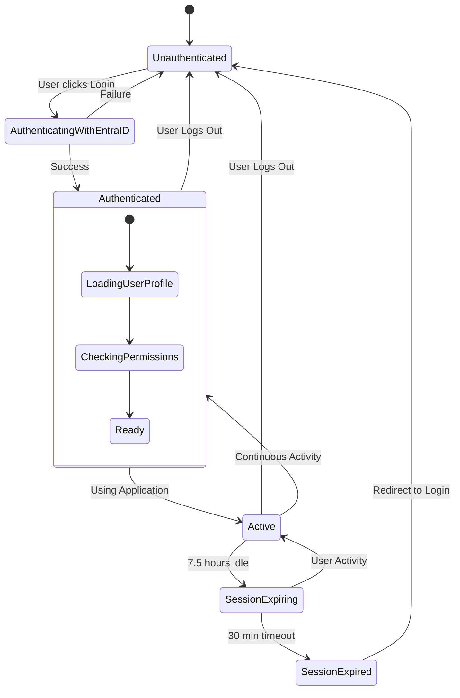
```mermaid
stateDiagram-v2
    [*] --> Unauthenticated

    Unauthenticated --> AuthenticatingWithEntraID : User clicks Login
    AuthenticatingWithEntraID --> Authenticated : Success
    AuthenticatingWithEntraID --> Unauthenticated : Failure

    Authenticated --> Active : Using Application
    Active --> Authenticated : Continuous Activity
    Active --> SessionExpiring : 7.5 hours idle
    SessionExpiring --> Active : User Activity
    SessionExpiring --> SessionExpired : 30 min timeout
    SessionExpired --> Unauthenticated : Redirect to Login

    Authenticated --> Unauthenticated : User Logs Out
    Active --> Unauthenticated : User Logs Out

    state Authenticated {
        [*] --> LoadingUserProfile
        LoadingUserProfile --> CheckingPermissions
        CheckingPermissions --> Ready
    }
```

---

## 8. Security Architecture

### 8.1 Security Layers

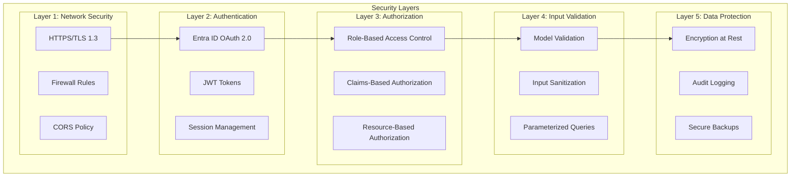
```mermaid
graph TB
    subgraph "Security Layers"
        subgraph "Layer 1: Network Security"
            HTTPS[HTTPS/TLS 1.3]
            FW[Firewall Rules]
            CORS[CORS Policy]
        end

        subgraph "Layer 2: Authentication"
            ENTRA[Entra ID OAuth 2.0]
            JWT[JWT Tokens]
            SESSION[Session Management]
        end

        subgraph "Layer 3: Authorization"
            RBAC[Role-Based Access Control]
            CLAIMS[Claims-Based Authorization]
            RESOURCE[Resource-Based Authorization]
        end

        subgraph "Layer 4: Input Validation"
            VALID[Model Validation]
            SANITIZE[Input Sanitization]
            PARAM[Parameterized Queries]
        end

        subgraph "Layer 5: Data Protection"
            ENCRYPT[Encryption at Rest]
            AUDIT[Audit Logging]
            BACKUP[Secure Backups]
        end
    end

    HTTPS --> ENTRA
    ENTRA --> RBAC
    RBAC --> VALID
    VALID --> ENCRYPT
```

### 8.2 Threat Mitigation


```mermaid
graph LR
    subgraph "Threats & Mitigations"
        subgraph "SQL Injection"
            THREAT1[Raw SQL Queries]
            MITIGATION1[Entity Framework + Parameterized Queries]
            THREAT1 -.->|Prevented by| MITIGATION1
        end

        subgraph "XSS Attacks"
            THREAT2[Unsanitized Output]
            MITIGATION2[Vue.js Auto-Escaping + CSP Headers]
            THREAT2 -.->|Prevented by| MITIGATION2
        end

        subgraph "CSRF Attacks"
            THREAT3[State-Changing Requests]
            MITIGATION3[Anti-CSRF Tokens + SameSite Cookies]
            THREAT3 -.->|Prevented by| MITIGATION3
        end

        subgraph "Unauthorized Access"
            THREAT4[No Authentication]
            MITIGATION4[Entra ID + JWT + Role Checks]
            THREAT4 -.->|Prevented by| MITIGATION4
        end

        subgraph "Data Breach"
            THREAT5[Plaintext Storage]
            MITIGATION5[TLS + Encrypted DB + Backups]
            THREAT5 -.->|Prevented by| MITIGATION5
        end
    end
```

---

## 9. Performance Optimization

### 9.1 Caching Strategy

```mermaid
graph TB
    REQUEST[Client Request]
    CACHE_CHECK{In Cache?}
    RETURN_CACHE[Return Cached Data]
    API_CALL[API Call]
    DB_QUERY[Database Query]
    CACHE_STORE[Store in Cache]
    RETURN_DATA[Return Data]

    REQUEST --> CACHE_CHECK
    CACHE_CHECK -->|Yes| RETURN_CACHE
    CACHE_CHECK -->|No| API_CALL
    API_CALL --> DB_QUERY
    DB_QUERY --> CACHE_STORE
    CACHE_STORE --> RETURN_DATA

    subgraph "Cache Layers"
        BROWSER[Browser Cache]
        APICACHE[API Response Cache]
        DBCACHE[Database Query Cache]
    end
```

### 9.2 Database Optimization

```mermaid
graph LR
    subgraph "Query Optimization"
        INDEX[Indexes on Foreign Keys]
        COMPOSITE[Composite Indexes]
        EAGER[Eager Loading]
        PAGINATION[Pagination]
    end

    subgraph "Connection Management"
        POOL[Connection Pooling]
        ASYNC[Async Queries]
        TIMEOUT[Query Timeouts]
    end

    subgraph "Data Management"
        SOFTDELETE[Soft Deletes]
        ARCHIVE[Data Archiving]
        CLEANUP[Periodic Cleanup]
    end

    INDEX --> POOL
    COMPOSITE --> POOL
    EAGER --> ASYNC
    PAGINATION --> ASYNC
    POOL --> SOFTDELETE
    ASYNC --> ARCHIVE
```

---

## 10. Monitoring & Observability

```mermaid
graph TB
    subgraph "Application"
        APP[LDA Outcomes Tool]
    end

    subgraph "Logging"
        APPLOG[Application Logs]
        ERRLOG[Error Logs]
        AUDITLOG[Audit Logs]
    end

    subgraph "Metrics"
        PERF[Performance Metrics]
        USAGE[Usage Statistics]
        HEALTH[Health Checks]
    end

    subgraph "Alerting"
        EMAIL[Email Alerts]
        DASHBOARD[Monitoring Dashboard]
    end

    APP --> APPLOG
    APP --> ERRLOG
    APP --> AUDITLOG
    APP --> PERF
    APP --> USAGE
    APP --> HEALTH

    ERRLOG --> EMAIL
    HEALTH --> EMAIL
    PERF --> DASHBOARD
    USAGE --> DASHBOARD
    HEALTH --> DASHBOARD
```

---

## Document Information

**Version**: 1.0
**Last Updated**: 2024-10-08
**Maintained By**: Development Team

## Rendering Diagrams

These diagrams use [Mermaid](https://mermaid.js.org/) syntax and can be rendered in:
- GitHub/GitLab (native support)
- VS Code (with Mermaid extension)
- Documentation tools (MkDocs, Docusaurus, etc.)
- Online editors (mermaid.live)
